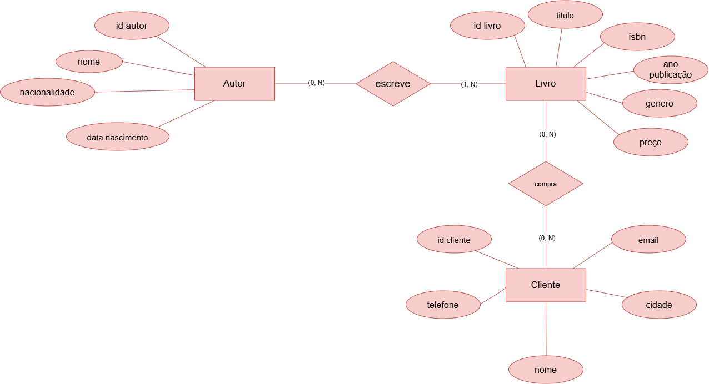
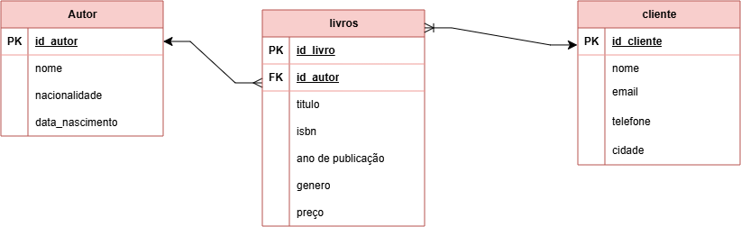

# Projeto: Gestão de Livros
## Modelo MER DER Conceitual

## Modelo MER DER Logico

## Dicionário de Dados
| Entidade | Atributo | Tipo | Tamanho | Descrição |
|:---|:---|:---|---:|:---|
| Livro | id_livro | int | 11 | Chave primária |
| Livro | titulo | varchar | 150 | Título do livro |
| Livro | isbn | varchar | 20 | Código ISBN do livro |
| Livro | ano_publicacao | int | 4 | Ano de publicação do livro |
| Livro | genero | varchar | 50 | Gênero literário do livro |
| Livro | preco | decimal | 10.2 | Valor do livro em reais |
| Autor | id_autor | int | 11 | Chave primária |
| Autor | nome | varchar | 40 | Nome do autor |
| Autor | nacionalidade | varchar | 40 | Nacionalidade do autor |
| Autor | data_nascimento | date | — | Data de nascimento do autor |
| Cliente | id_cliente | int | 11 | Chave primária |
| Cliente | nome | varchar | 40 | Nome do cliente |
| Cliente | email | varchar | 100 | Endereço de e-mail do cliente |
| Cliente | telefone | varchar | 20 | Número de telefone do cliente |
| Cliente | cidade | varchar | 40 | Cidade do cliente |
| Livro | id_autor | int | 11 | Chave estrangeira, referência: Autor(id_autor) |

## Dados de teste
- [autor.csv](autor.csv)
- [livros.csv](livros.csv)
- [cliente.csv](cliente.csv)

